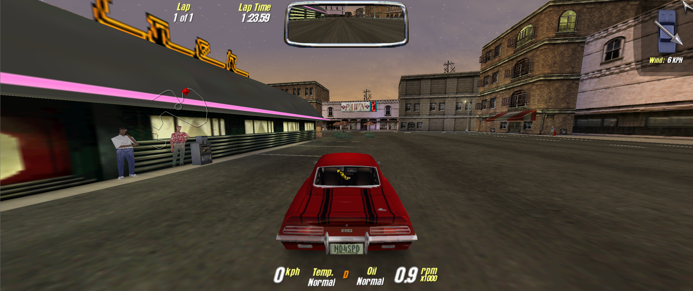

# MCOWidescreenMod
- [x] [Gameplay Video on YouTube](https://youtu.be/bUJhDdW17Js)

This mod brings proper widescreen resolutions to Motor City Online, including a corrected field of view, scaled User Interface elements, and more.
- It works with the following game builds: **1.0.136.0** (aka Sunset, used on community servers) and **1.0.117.0** (aka Debug or offline, without UI scaling);
- Choose the screen resolution directly in the game settings, according to your OS resolution list;
- The main menu is no longer locked to 800 x 600! The menu UI will now be "letterboxed" on wide displays;
- Skip movies by default, intro movies will also be scaled to your screen size;
- It is compatible with the community-made launcher and server emulator;

Including some bug fixes:
- Prevent "togglewindowtest.txt" from being created, since it locks the ability to use Alt+Enter or to change the Windowed mode;
- Fix for the "Free Hard Drive space" error;
- When in Windowed mode, the game will no longer force a full-screen view when booting up;
- Fix for an invalid GPU memory size on modern cards, this allows real-time Car Reflections to be enabled;
- The mini-map will be properly scaled on high resolutions.

## How to install
1) Download and unpack the latest mod release into the game folder where mcity.exe is located.
2) mco_dxvk is **not** required, but can be used if there are any issues;
3) Launch the game and go to Options > Display, and set your real screen resolution here. This only needs to be done **once**.
4) Enjoy!

## Troubleshooting
dgVoodoo is compatible with the mod, however only the DirectX 8 (DX8) mode is supported. I do not provide any support for the Glide renderer.

> I got a "Video Display Mode" error

This usually means that the game is unable to detect your current screen resolution. Try unpacking _mco_dxvk_ into the game folder, then start the game.
> My screen resolution isn't listed in the Options menu

The game is always looking for video modes which must also be available in your Operating System settings.
> I've got a very low framerate for no reason

Graphics features such as real-time Car Reflections or the Fog option may run bad on modern PCs. Try disabling them in the game settings. Please note that, unlike the NFS3 Modern Patch, this mod does not improve GFX effect compatibility on modern PCs.
> I'm playing on the Debug build and the game UI is stretched.

Only the online-compatible game build (1.0.136.0) is fully supported in terms of UI features.

## Credits
- _mINI_ configuration file loader: https://github.com/metayeti/mINI
- _Ultimate ASI Loader_: https://github.com/ThirteenAG/Ultimate-ASI-Loader
- _DXVK_ (D8VK) fork: https://github.com/AlpyneDreams/d8vk
- _Injector_ by LINK/2012: https://github.com/thelink2012/injector
